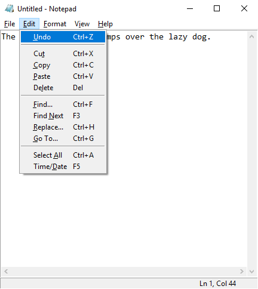

# notepad
Python clone of Microsoft's classic text editor.



This project aims to replicate the basic text editor that has shipped with the Microsoft Windows operating system since 1985. No specific version of the program is being targeted. The goal is to include the "greatest hits" of Notepad's features, and provide a versatile cross-platform editor with a familiar user interface.    

## Requirements
 - Python 3
 - Tkinter

## Usage
Start notepad using: 
```bash
python notepad.py
``` 

## Contributing
Users are encouraged to open any issues found with the program.

Pull requests are welcome to fix issues, or to add new features.

New features are welcome if they are present in a version of Microsoft Notepad, and are implemented in the same way. 

## Files
[notepad.py](notepad.py) - Main program, execute this to start

[tkfontpicker.py](tkfontchooser.py) - Copy of j4321's [tkfontchooser](www.github.com/j4321/tkfontchooser/), made 4/11/2019

[fontpicker.py](fontpicker.py) - Modifications to [tkfontpicker](tkfontchooser.py) to make interface match Font dialog in Microsoft Notepad

[notepad.ico](notepad.ico) - Primary icon file

[transparent.ico](transparent.ico) - Transparent icon file used for popups

[test.txt](test.txt) - Some text used to test file open/save/save as features


## Acknowledgement
[Richard Brodie](https://en.wikipedia.org/wiki/Richard_Brodie_(programmer)/) - Original Microsoft Notepad author

## License
[GLWT](LICENSE)

